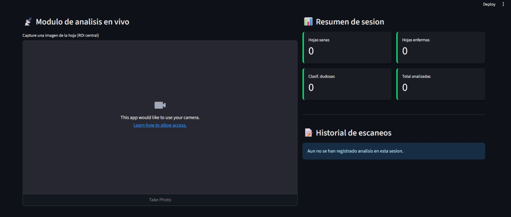
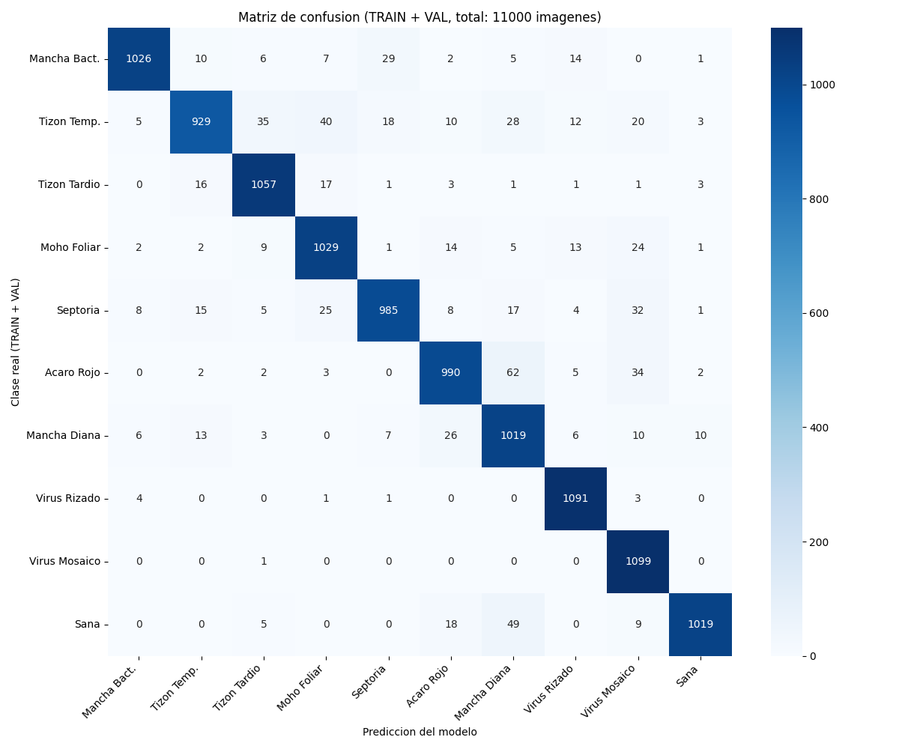

# TomateCNN

**Diagnóstico en tiempo real de 9 enfermedades + hoja sana (10 clases) en hojas de tomate**  
MobileNetV2 + TensorFlow Lite · 2025

[](https://www.python.org)
[](https://www.tensorflow.org)
[](https://streamlit.io)
[](https://opencv.org)
[](https://github.com/Cristian-Acevedo-C/TomateCNN)
[](https://opensource.org/licenses/MIT)

**Autor:** Cristian Acevedo Cifuentes

---

## Resultados reales (11 000 imágenes)

| Métrica                    | Valor      |
|----------------------------|------------|
| **Accuracy global**        | **93.1 %** |
| **F1-score macro**         | **0.93**   |
| Mejor clase                | Virus Mosaico → **99.9 %** |
| Clase más difícil          | Tizón Temprano → **84.5 %** |

---

## Componentes principales

| Archivo                    | Descripción                                           |
|----------------------------|-------------------------------------------------------|
| `detector_tomates.py`      | Detector en tiempo real con webcam (OpenCV)           |
| `panel_gestion.py`         | Dashboard web profesional (Streamlit)                 |
| `procesador_lotes.py`      | Evaluación masiva sobre carpetas                      |
| `generar_matriz_full.py`   | Métricas completas + matriz de confusión              |
| `test_model_info.py`       | Diagnóstico rápido del modelo                         |
| `model.tflite`             | Modelo cuantizado (~6 MB)                             |

---

## Capturas

## Dashboard web (Streamlit)

[](https://tomatecnn-ganknc3pg2vlhaznlbt8ob.streamlit.app/)

**Live Demo**  
<a href="https://tomatecnn-ganknc3pg2vlhaznlbt8ob.streamlit.app" target="_blank">
  
</a>


### Matriz de confusión (11 000 imágenes)


### Detector en tiempo real
*Captura en proceso…*

---

## Instalación

```bash
pip install -r requirements.txt
```

Uso rápido
Bash# Dashboard web (recomendado)
```bash
streamlit run panel_gestion.py
```

# Detector con webcam
```bash
python detector_tomates.py
```

Fuente del dataset
Subconjunto “tomato” del dataset PlantVillage
Hughes & Salathé (2015) · arXiv:1511.08060
Licencia: CC0 Public Domain
Versión usada en Kaggle: https://www.kaggle.com/datasets/kaustubhb999/tomatoleaf

TomateCNN — Probando DL.
Cristian Acevedo Cifuentes · 2025


